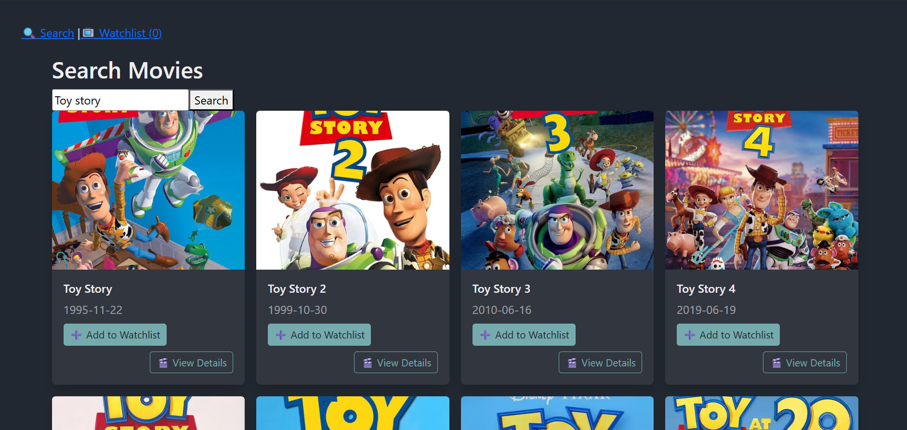
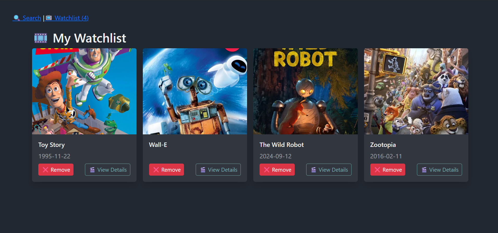

# 🎬 Movie Watchlist Tracker

A clean, full-stack Movie Tracker app where you can search for movies, add them to your personal watchlist, and view detailed info — all powered by the TMDB API. Built with **React**, **Flask**, **SQLite**, **Bootstrap**, and a custom dark theme.

---

## 📸 Preview

### 🏠 Home Page

### 📋 Watchlist Page

---

## ⚙️ Tech Stack

| Frontend | Backend | Database | Styling |
|----------|---------|----------|---------|
| React (Vite) | Flask (Python) | SQLite | Bootstrap |

---

## 🌟 Features

- 🔍 Search movies using TMDB API
- 📥 Add/remove movies from a persistent watchlist
- 🎬 View movie details
- 📱 Responsive layout with Bootstrap Grid
- ✅ Fully connected frontend + backend

---
